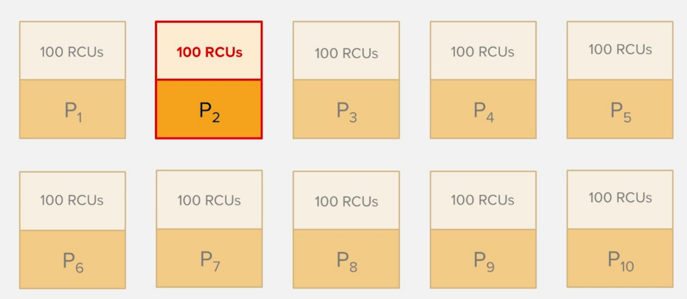

## Topics
- Basics
	- Differences between relational and NoSql databases
- DynamoDB Basics
	- Data types
	- Consistency model
	- Capacity Units
- Partitions
- Indexes
	- Global and Local Secondary Indexes
- Key design

# Basics
## Relational databases

- organizes data in tables
  - normalised data
- tables consists of columns and rows
- relationships between tables
  - referencial integrity
    - primary key -> foreign key
- flexible retrieval using query language

## Data Normalization
#### Why
- Organize data efficiently
- Eliminate redundant data

#### Forms
- **1NF**: Eliminate repeating groups
- **2NF**: Eliminate redundant data
- **3NF**: Eliminate columns which are not dependent on the key

## 1. Normal form

### Not normalised

Id  Dept  Name            Subject1  Subject2   Subject3
--  ----  ----            --------  --------   --------
1   M01   Eric Idle       Physics   Chemistry  Maths
1   M01   Graham Chapman  History   Geography  Physics


### Normalised
Id  Dept  Name            Subject
--  ----  ----            --------  
1   M01   Eric Idle       Physics   
1   M01   Eric Idle       Chemistry  
1   M01   Eric Idle       Maths
1   M01   Graham Chapman  History   
1   M01   Graham Chapman  Geography 
1   M01   Graham Chapman  Physics

## Types of NoSQL Databases

::: columns
:::: column
### Columnar database
- writes columns instead of rows
- used for datawarehouses and analytics

### Key-Value stores
- stores key-value pairs
- used for read- and compute-heavy workloads

:::
:::: column
### Graph database
- stores graphs and trees
- used for data, which is highly interconnected

### Document database
- stores data in documents
- more flexible than relational
- more powerful than key-value stores

::::
:::


## NoSql
### Advantages over relational
- Organises data more object oriented
  - solves the _object-relational impedence mismatch_
- simpler design, less strict
- better scaling

###  Disadvantages over relational
- Not strict ACID
  - Eventual consistency
- Transactions are harder
- No restructuring of data on the fly
- Not normalised => Redundant data


## Scaling

::: columns
:::: column
### SQL
**vertical scaling**

- add more power (CPU, memory)
- ACID
  - Atomicity
  - Consistency
  - Integrity
  - Durability

::: 
:::: column
### NoSQL
**Horizontal scaling**

- add more machines or partitions
- Eventual consistency

::::
:::


# DynamoDB Basics

## Features
- Serverless
	- Servers are managed by AWS
- Cloud
	- Doesn't run locally
- NoSQL
- Fast
	- Response times in milliseconds
	- Can be brought down to microseconds
- Cost effective, paid by
	- Read/Write capacity
	- Data volume
- Highly Scalable
	- On demand
- Fault tolerant
	- Automatic replication and backups
- Secure
	- Fine grained access control

## Terminology comparison

----------------------------------------------------------------------------------------
**Relational**								**DynamoDB**
--------									--------------------------------------------
Tables										Tables

Rows										Items

Columns										Attributes

_Primary keys:_								_Primary Keys:_
Multicolumn									one or two attributes

Indexes										Local Secondary Indexes

Views										Global Secondary Indexes
----------------------------------------------------------------------------------------


## Data types

### Scalar types
- Exactly one value
	- string
		- only non-empty values
	- number
	- binary
		- only non-empty values
	- boolean
	- null

### Set types
- Multiple scalar types

### Document types
- Complex structures with nested attributes
	- lists
	- maps

## Set types
- Unordered collection of scalar values
- No duplicates
- No empty set is allowed
- Only one data type per set

### Example
`[ "Hello World" ]`

## Document types
### Overview
- Complex structures with nested attributes
- Up to 32 levels deep
- Only non-empty values 
- `Lists` and `maps` _can_ be empty

## Document types
### Lists
- Ordered collection of values
- Can have multiple data types

#### Example
`[ "Eric Idle", 80, false ]`


## Document types
### Maps
- Unordered collection of Key-Value pairs

#### Example
```json
{
  "name": "Eric Idle",
  "age": 80,
  "state": {
	  "hasCeasedToBe": false
  }
}
```

## Consistency Model
Data is replicated to at least 3 facilities within an availability zone (AZ) of a region

::: columns
:::: column
### Eventual read consistency
- May be out of date (couple milliseconds)
- Default consistency
- Half as expensive as strong consistency
- Reads from any facility
:::
:::: column
### Strong read consistency
- Most up-to-date data
- Reads from the write replica
- Must be requested explicitly
::::
:::


## Capacity Units
- 1 capacity unit = 1 request per second
- Used for pricing
- Used to tune the performance
- Two types:
	- Read Capacity Units (RCUs)
	- Write Capacity Units (WCUs)
- allows for auto-scaling

## Capacity Units
::: columns
:::: column
### Read Capacity Units
- One strongly consistent read per second
- Two eventually consistent reads per second
- In blocks of 4KB

:::
:::: column
### Write Capacity Units
- One write per second
- In blocks of 1KB

::::
:::

DynamoDB **rounds** the item size **up** to the next KB

## Capacity Unit
### Burst Credits

## Capacity Unit
### Billing
- Provisioned Capacity Cost
  - Fixed rate per hour, regardless of the usage
  - Steady, predictable workload

- Burst Capacity 
  - Are included in the provisioned throughput capacity

- On-Demand Capacity
  - Pay-as-you-go
  - More expensive than _Provisioned Capacity_
  - Highly variable or unpredictable workloads

Read and write can be different capacities
(Provisioned and On-Demand Capacity)


# Partitions
## Partitions
### Overview
- How DynamoDB splits data internally
- Number of partitions is managed by DynamoDB internally
	- Depends on 
	  - size of data
	  - provisioned capacity
- 1 partition can hold **10 GB** of data
- 1 partition supports **1000 WCUs** and **3000 RCUs**

## Partitions
### Example
- 28 GB of data -> 3 Partitions
- 1500 WCUs -> 2 Partitions
- 3000 RCUs -> 1 Partitions

`total partitions = max(3, 2 + 1)`

## Partitions
### Hashfunction
`partition id = hash(id, # of partitions)`

### Consistent hashing
- solves the problem of rehashing after an addition of a partition

## Partitions
### Partition key (Hash key)
- **Mandatory**
- Index on partition key (primary key)
- Defines the partion the item will be stored
- Every query **must** specify the partition key

### Sort key (Range key)
- _Optional_
- Defines the order in the partition
- Usages:
	- Refine the query (timestamp)
	- Categorize the data (position of a football player)
	- Pagination 


## Indexes

- **WorldId**: [Partition](Partition) key
- **PlayerName**: Sort key

**WorldId**  **PlayerName**  **Score**
-------      ----------      ------
Eldoria      Thaldrin        8023
Drakmoria    Thaldrin        3522
Eldoria      Grimblade       6523
Sylvanthan   Seraphina       6324
Drakmoria    Valandor        4324
Celestara    Rurik           9235
Celestara    Lyria           1034

## Indexes
Read player "Grimblade":

- Partition key: _Eldoria_
- Sort key: _Grimblade_

**WorldId**  **PlayerName**  **Score**
-------      ----------      ------
Eldoria      Thaldrin        8023
Drakmoria    Thaldrin        3522
**Eldoria**  **Grimblade**   **6523**
Sylvanthan   Seraphina       6324
Drakmoria    Valandor        4324
Celestara    Rurik           9235
Celestara    Lyria           1034


## Indexes
Read all players from "Eldoria"

- Partition key: _Eldoria_
- No sort key used for querying
- sorted by `PlayerName`

**WorldId**  **PlayerName**  **Score**
-------      ----------      ------
**Eldoria**  **Thaldrin**    **8023**
Drakmoria    Thaldrin        3522
**Eldoria**  **Grimblade**   **6523**
Sylvanthan   Seraphina       6324
Drakmoria    Valandor        4324
Celestara    Rurik           9235
Celestara    Lyria           1034

## Local Secondary Index (LSI)
- Have the _same partition key_
- Have a _different sort key_
- Must be created during creation of the table
- Up to 5 LSI per table


## Local Secondary Index (LSI)
- **WorldId**: Partition key
- **Score**: Sort key

**WorldId**  **PlayerName**  **Score**
-------      ----------      ------
Eldoria      Thaldrin        8023
Drakmoria    Thaldrin        3522
Eldoria      Grimblade       6523
Sylvanthan   Seraphina       6324
Drakmoria    Valandor        4324
Celestara    Rurik           9235
Celestara    Lyria           1034

## Local Secondary Index (LSI)
Read all players from "Eldoria" sorted by `Score`

- Partition key: _Eldoria_
- No sort key used for querying
- sorted by `Score`

**WorldId**  **PlayerName**  **Score**
-------      ----------      ------
**Eldoria**  **Thaldrin**    **8023**
Drakmoria    Thaldrin        3522
**Eldoria**  **Grimblade**   **6523**
Sylvanthan   Seraphina       6324
Drakmoria    Valandor        4324
Celestara    Rurik           9235
Celestara    Lyria           1034

## Global Secondary Index (GSI)
- Have a _different partition key_
- Have a _different sort key_
- Can be created after creation of the table
- Up to 5 GSI per table
- Partition key doesn't need to be unique
- Can be used to create a subset of the table
- Allow only eventual consistent reads

## Global Secondary Index (GSI)
- **PlayerName**: Partition key
- **Score**: Sort key

**WorldId**  **PlayerName**  **Score**
-------      ----------      ------
Eldoria      Thaldrin        8023
Drakmoria    Thaldrin        3522
Eldoria      Grimblade       6523
Sylvanthan   Seraphina       6324
Drakmoria    Valandor        4324
Celestara    Rurik           9235
Celestara    Lyria           1034

## Global Secondary Index (GSI)
Read all scores of player "Thaldrin"

- Partition key: _Thaldrin_
- Sort key: _Score_
- sorted by `Score`

**WorldId**   **PlayerName**  **Score**
-------       ----------      ------
**Eldoria**   **Thaldrin**    **8023**
**Drakmoria** **Thaldrin**    **3522**
Eldoria       Grimblade       6523
Sylvanthan    Seraphina       6324
Drakmoria     Valandor        4324
Celestara     Rurik           9235
Celestara     Lyria           1034

## Comparison
::: columns
:::: column

### Local secondary index

- Same partition key
- Uses the tables throughput (RCUs and WCUs)

:::
:::: column
### Global secondary index

- Different partition key
- Uses the own throughput (RCUs and WCUs)

# Key design

## Key design

::: columns
:::: column
### Simple Keys
**Partition Key**

- needs to be unique
::: 
:::: column
### Composite Keys
**Partition Key** and **Sort Key**

- partition key can occur multiple times
- Combination of partition and sort key need to be unique
:::: 
::: 

Both keys can only contain _scalar types_:

- string
- number
- binary


## Key design
### Data distribution

- Ensure uniform distribution of data across partitions
- Use as many unique values for partition key as possible

### Read/write patterns

- RCUs and WCUs get equally distributed between the partitions
- prevent hot partitions
- Ensure uniform utilization of RCUs and WCUs

## Avoid hot partitions
1000 RCUs across 10 Partions => 100 RCUs per partition

Most request to one partition => 900 RCUs remain unused

## Avoid hot partitions
### Time series data

- Store most recent data in own table, older in a second one

### Scan operations and Filters
- Scan operations read data from all partitions
- Filter will be applied only after read
  - RCUs are calculated **before** applying the filter
- Queries are the only efficient way to fetch data


## Global Secondary Index (GSI)
### Best practices
- Design for uniform workloads
- Use sparse indexes
  - Less items than in the table
- Project fewer items
  - Results in less RCUs


