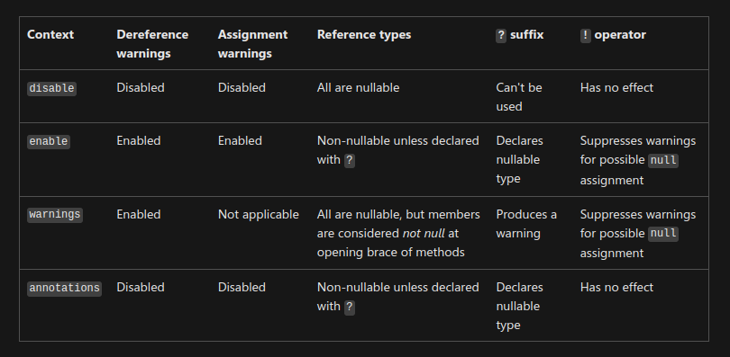

## Topics
- What are nullables
- How are nullable checked
- Migration to nullables

# What are nullables?

## `default` values
```cs
string hello;
int count;
DateTime date;
```

## Nullable value types

```cs
int notNullable = null; // compiler error
Nullable<int> nullable = null; // initialized with null
int? nullableShorthand = null; // initialized with null
int? defaultNullable = default; // initialized with null
int? instance = new(); // initialized with 0
```

## Nullable reference types

### Prior to C\# 8
```cs
string nullable = null // compiles
```

### Since C\# 8
```cs
string notNullable = null // compiler warning
string? nullable = null // compiles
```

## Why?

- Enables static compiler analysis
- NullReferenceException is the most common runtime exception
- Less null checks in code --> less CPU cycles


# How the compiler checks the null state

## Null state
- `not-null`
	- the variable has been assigned a value that is known to be _not null_.
	- the variable has been checked against null and wasn't modified since.
		- the variable can be dereferenced safely
- `maybe-null`
	- all other cases
		- the variable must be checked before dereferencing it


## Dereferencing

```cs
string? message = null;
Console.Write($"length: {message.Length}"); // Warning!

Console.Write($"length: {message?.Length}");

message = "hello"
Console.Write($"length: {message.Length}");
```

## Non-nullable properties I
- Must contain a non-nullable value when exiting constructor

### Set default values
```cs
public record Person
{
    public Person(string lastName)
    {
        LastName = lastName;
    }

    public string FirstName { get; } = String.Empty;
    public string LastName { get; }
}
```

## Non-nullable properties II
- Must contain a non-nullable value when exiting constructor

### Constructor chaining
```cs
public record Person
{
    public Person(string lastName) { LastName = lastName; }
	public Person() : this("Cleese")

    public string LastName { get; }
}
```


## Non-nullable properties III
- Compiler doesn't follow into methods


### Nullable Attribute

--> See code


## Generics I

### `T` is reference type

`T?` --> `T?`

`T` is string --> `T?` is string?

### `T` is nullable reference type

`T?` --> `T?`

`T` is string? --> `T?` is string?

### `T` is value type

`T?` --> `T`

`T` is int --> `T?` is int

### `T` is nullable value type

`T?` --> `T?`

`T` is int? --> `T?` is int?


## Generics II Constraints

### Constraint `class`

```cs
public T Get<T>()  where T: class
```

- `T`: non-nullable reference type

### Constraint `class?`

```cs
public T Get<T>()  where T: class?
```

- `T`: non-nullable reference type
- `T`: nullable reference type

### Constraint `notnull`

```cs
public T Get<T>()  where T: notnull
```

- `T`: non-nullable reference type
- `T`: non-nullable value type

# Migration
## Nullable contexts


## Setting the context
### `csproj`
```xml
<Project Sdk="Microsoft.NET.Sdk">
  <PropertyGroup>
    <Nullable>enable</Nullable>
    <Nullable>disable</Nullable>
    <Nullable>warnings</Nullable>
    <Nullable>annotations</Nullable>
  </PropertyGroup>
</Project>
```
### Pre-processors

```cs
#nullable enable
#nullable disable
#nullable warnings
#nullable annotations
```

## First Steps
### Set the default for project
- Nullable disable
	- big code bases
	- new code need pre-processors
	- more mature and stable projects
- Nullable enable
	- more work upfront (pre-processors in every/many file(s))
	- more active projects

## Understanding contexts 
### Nullability of reference types
```
						 ,- YES --> nullable
						/
         ,- YES --> annotated (T?) - NO --> non-nullable
		/ 
annotation enabled 
		\
		 `- NO --> annotated (T?) - NO --> oblivious
						\
						 `- YES --> oblivious
```

## Understanding warnings
### Warnings
- potential `null` value is assigned to a _non-nullable_ type
- a nullable type with _maybe-null_ state is dereferenced
- an oblivious type with _maybe-null_ state is dereferenced and the warning context is enabled

## Understanding default nullability
### Default Nullability
- Nullable variables
	- _maybe-null_
- Non-nullable variables
	- _not-null_
- Nullable oblivious variables
	- _not-null_

## Escalate the warnings
- Treat warnings as errors
	- build fails when nullable warnings are not addressed
- Set context to `warnings`
	- all types remain oblivious
	- fix warnings when you dereference a _maybe-null_ variable
- Set context to `annotations`
	- Reference types are now _non-nullable_
	- Annotate variables, which are considered nullable (`T?`)
	- Ensure a variable is not null, which are considered non-nullable
- Set context to `enable` 
	- remove all pre-processors


## Treat the warnings as errors

```xml
<Project Sdk="Microsoft.NET.Sdk">
  <PropertyGroup>
    <Nullable>enable</Nullable>
	<TreatAsError>Nullable</TreatAsError>
  </PropertyGroup>
</Project>
```

